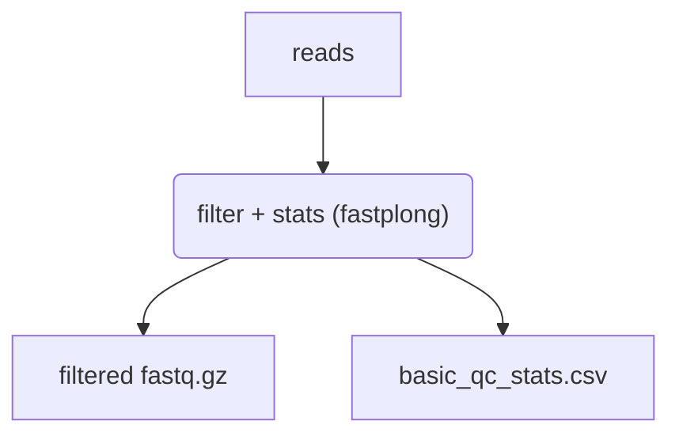

# Basic Nanopore QC

A generic pipeline that can be run on an arbitrary set of Oxford Nanopore sequence files, regardless of the project or organism of interest.

Reads are filtered by length and mean quality, and sequence statistics are collected before and
after filtering. The filtered reads can be published for use as input to another pipeline.



## Analyses

* [`fastplong`](https://github.com/OpenGene/fastplong): Filter reads and collect QC stats (default)
* [`nanoq`](https://github.com/esteinig/nanoq): Filter reads and collect QC stats

Either tool produces the same output file with the same columns. `fastplong` is used by default;
pass `--tool nanoq` to use `nanoq` instead. `fastplong` reports both sides of filtering from a
single pass, while `nanoq` reports on whatever it emits and so is run once either side of the
filtering step.

Adapter trimming is disabled. Reads are expected to have had adapters, barcodes and primers
removed already, and filtering here drops whole reads rather than trimming them.

## Usage

```
nextflow run BCCDC-PHL/basic-nanopore-qc \
  [--prefix 'prefix'] \
  [--tool fastplong|nanoq] \
  [--publish_filtered_reads] \
  --fastq_input <your fastq input directory> \
  --outdir <output directory>
```

Long-read fastq files are discovered by the `_RL` or `_L` filename suffix, for example
`<library_id>_<barcode>_RL.fastq.gz`. The sample ID is taken from the filename up to the
first underscore.

### Filtering parameters

| Param | Default | Description |
| --- | --- | --- |
| `--tool` | `fastplong` | QC and filtering tool: `fastplong` or `nanoq` |
| `--min_length` | `200` | Discard reads shorter than this |
| `--min_mean_quality` | `10` | Discard reads with mean base quality below this |
| `--max_length` | `0` | Discard reads longer than this. `0` disables |
| `--publish_filtered_reads` | off | Write the filtered reads to the output directory |

> **Choose `--min_length` to suit your target.** The default of 200 is deliberately
> permissive. A length floor set above the shortest sequence of interest will remove it
> from the output entirely and without warning: influenza A's NS segment is ~890 nt and
> its M segment ~1027 nt, so a 1000 nt floor would discard segment 8 completely and most
> of segment 7.

The filtered reads are only written to the output directory when `--publish_filtered_reads` is
set. They are always produced and hashed into the provenance record either way, so the
provenance describes what the pipeline computed rather than what it copied out.

### SampleSheet Input

Reads may also be provided by samplesheet, which is useful when input paths are generated
programmatically rather than discovered from a directory. Prepare a `samplesheet.csv` file
with the following fields:

```
ID
LONG_READS
```

...for example:

```csv
ID,LONG_READS
sample-01,/path/to/sample-01_barcode01_RL.fastq.gz
sample-02,/path/to/sample-02_barcode02_RL.fastq.gz
```

...then run the pipeline using the `--samplesheet_input` flag as follows:

```
nextflow run BCCDC-PHL/basic-nanopore-qc \
  --samplesheet_input samplesheet.csv \
  --outdir <output directory>
```

## Output

A collected stats file is written to the top level of the output directory, alongside a
per-sample directory holding that sample's reports and provenance.

```
outdir
|-- basic_qc_stats.csv
|-- sample-01
|   |-- sample-01_20240325154538_provenance.yml
|   |-- sample-01_RL.filtered.fastq.gz
|   |-- sample-01_fastplong.csv
|   |-- sample-01_fastplong.html
|   `-- sample-01_fastplong.json
`-- sample-02
    `-- ...
```

If a prefix is provided using the `--prefix` flag, it is prepended to the collected filename,
for example `prefix_basic_qc_stats.csv`. Under `--tool nanoq` the per-sample report is a single
`sample-01_nanoq.csv`; nanoq produces no html or json report.

Each statistic is reported before and after filtering:

```csv
sample_id,total_reads_before_filtering,total_reads_after_filtering,total_bases_before_filtering,total_bases_after_filtering,...
sample-01,400,213,254934,190616,...
sample-02,400,213,251871,186758,...
```

...with the full set of statistics being `total_reads`, `total_bases`, `mean_read_length`,
`median_read_length`, `shortest_read_length`, `longest_read_length`, `read_n50`,
`mean_base_quality` and `median_base_quality`, each with a `_before_filtering` and an
`_after_filtering` variant.

The two tools do not calculate read quality the same way: nanoq averages error
probabilities, while fastplong averages Phred scores and bins them to whole Q
values. Expect the quality columns to shift by up to about one Q unit when switching
tools, and fastplong's median to be a whole number. The read counts and lengths are
directly comparable.

## Provenance

In the output directory for each sample, a provenance file will be written with the following format:

```yml
- pipeline_name: BCCDC-PHL/basic-nanopore-qc
  pipeline_version: 0.3.0
  nextflow_session_id: ceb7cc4c-644b-47bd-9469-5f3a7658119f
  nextflow_run_name: voluminous_jennings
  timestamp_analysis_start: 2024-03-19T15:23:43.570174-07:00
- input_filename: sample-01_barcode01_RL.fastq.gz
  input_path: /path/to/sample-01_barcode01_RL.fastq.gz
  sha256: 2793587aeb2b87bece4902183c295213a7943ea178c83f8b5432594d4b2e3b84
- process_name: fastplong
  tools:
    - tool_name: fastplong
      tool_version: 0.6.0
      parameters:
        - parameter: --disable_adapter_trimming
          value: null
        - parameter: --length_required
          value: 200
        - parameter: --mean_qual
          value: 10
        - parameter: --length_limit
          value: 0
- input_filename: sample-01_RL.filtered.fastq.gz
  input_path: /path/to/work/sample-01_RL.filtered.fastq.gz
  sha256: 6b1c6a558b4a8ffd6fb3bdc7a7bb0f49006b640808affe45d81d47e7895058c1
```

The middle block records whichever tool was selected by `--tool`. Under `--tool nanoq` it is
three blocks, one for each of the stats passes either side of the filtering step:

```yml
- process_name: nanoq_prefilter
  tools:
    - tool_name: nanoq
      tool_version: 0.10.0
      parameters:
        - parameter: --stats
          value: null
- process_name: filter
  tools:
    - tool_name: nanoq
      tool_version: 0.10.0
      parameters:
        - parameter: --min-len
          value: 200
        - parameter: --min-qual
          value: 10
        - parameter: --max-len
          value: 0
- process_name: nanoq_postfilter
  tools:
    - tool_name: nanoq
      tool_version: 0.10.0
      parameters:
        - parameter: --stats
          value: null
```
